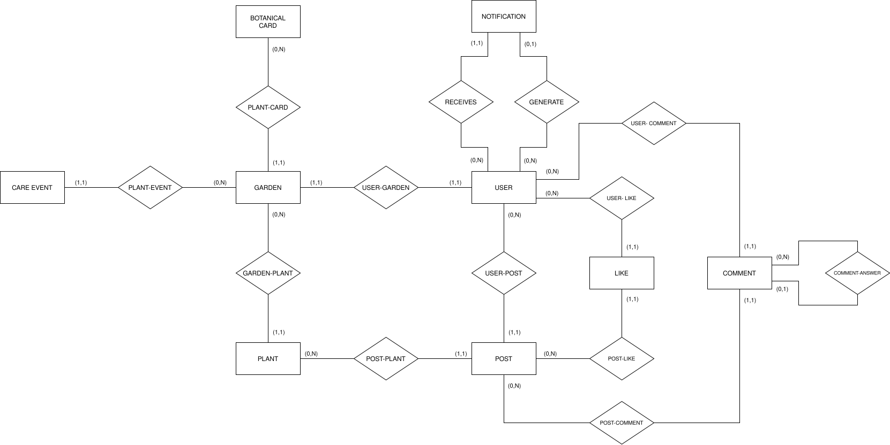

# Documento di Ideazione - PhytoSend

## 1. Scenari di Utilizzo
Sulla base della visione di PhytoSend come un social network che unisce la cura del verde al benessere comunitario, sono stati individuati i seguenti scenari principali:

- **Scenario A (Gestione Personale):** Un utente utilizza l'applicazione per gestire il proprio "angolo verde". Vuole registrare una nuova pianta appena acquistata, ricevere consigli sulla cura consultando il catalogo botanico e ricevere notifiche automatiche per le annaffiature per evitare che la pianta muoia. *Dispositivo prevalente: smartphone, durante la routine quotidiana di cura delle piante.*
- **Scenario B (Social & Supporto):** Un utente nota che una delle sue piante ha delle macchie sulle foglie. Condivide una foto nel feed pubblico e chiede consiglio alla community. Un altro utente, esperto coltivatore, visualizza la richiesta e fornisce una diagnosi utile tramite un commento. *Dispositivo: indifferente (smartphone per chi pubblica in mobilità, computer o tablet per chi legge e risponde con più calma).*
- **Scenario C (Moderazione e Amministrazione):** Un amministratore della piattaforma naviga nell'Admin Panel per monitorare le statistiche di sistema e gestire le funzionalità core (come la ricarica dei dati del catalogo e la visione d'insieme) per assicurare la stabilità del servizio. *Dispositivo prevalente: computer desktop, data la natura gestionale e la necessità di avere una visione d'insieme del pannello.*

---

## 2. Attori e Obiettivi

### Scenario A: Gestione Personale
- **Attore:** Giardiniere (Utente Base `USER`).
- **Obiettivo:** Popolare il proprio giardino digitale e ricevere notifiche automatiche e tempestive per la cura.

### Scenario B: Social & Supporto
- **Attori:**
  - **Giardiniere in difficoltà (Utente Base `USER`):** Vuole ricevere un parere affidabile su un problema.
  - **Esperto (Utente Base `USER`):** Vuole condividere la propria conoscenza, commentare e lasciare "Like" per aiutare gli altri.
- **Obiettivo:** Risolvere un problema di cura della pianta tramite l'interazione sociale.

### Scenario C: Moderazione e Amministrazione
- **Attore:** Amministratore (Utente `ADMIN`).
- **Obiettivo:** Gestire la piattaforma, monitorare i dati globali e forzare sincronizzazioni (es. caricamento dei dati di default del catalogo).

---

## 3. Casi d'Uso (Descrizione dei procedimenti)

### Caso d'Uso 1: Adozione di una nuova pianta dal Catalogo (Rif. Scenario A)
1. L'utente effettua il login e accede alla dashboard personale "Il mio Giardino".
2. Clicca sul pulsante per aggiungere una nuova pianta, aprendo la modale di aggiunta.
3. Cerca una specie nel Catalogo Botanico integrato tramite il campo di ricerca con autocompletamento e seleziona la pianta desiderata.
4. Inserisce opzionalmente un soprannome per la pianta e conferma cliccando "Salva nel Giardino".
5. Il backend registra la pianta associandola al giardino dell'utente e genera automaticamente gli eventi di cura con le relative scadenze.
6. L'utente riceverà notifiche automatiche generate periodicamente dal sistema (`CareEventScheduler`) quando la pianta avrà bisogno di cure.

### Caso d'Uso 2: Richiesta SOS e Interazione Sociale (Rif. Scenario B)
1. L'utente effettua il login ed accede alla bacheca pubblica (Feed).
2. Crea un nuovo post, caricando la foto della pianta malata dalla galleria.
3. Sceglie se restare nella sezione "Nuova pianta" o "Dal Giardino"
4. Seleziona la pianta, aggiunge una descrizione e pubblica il post.
5. Un utente esperto effettua il login, naviga nel feed e vede il post.
6. L'utente esperto inserisce un commento con un consiglio pratico.
7. L'autore del post riceve una notifica che lo avvisa del nuovo commento.
8. L'autore può rispondere al commento e/o mettere "Mi Piace" per ringraziare.

### Caso d'Uso 3: Monitoraggio e Gestione della Piattaforma (Rif. Scenario C)
1. L'amministratore effettua il login con le proprie credenziali admin.
2. Il sistema riconosce il ruolo `ADMIN` e rende visibile il link al pannello di amministrazione nella navbar.
3. L'amministratore accede all'AdminPanel, dove visualizza le statistiche aggregate della piattaforma: numero di utenti registrati, piante censite, post pubblicati e catalogo botanico.
4. Naviga nella sezione del catalogo botanico per verificare la completezza dei dati delle specie presenti.
5. Se necessario, avvia manualmente il ricaricamento (re-seed) dei dati del catalogo tramite l'apposita funzione.
6. Può consultare la lista degli utenti e dei loro giardini per avere una visione d'insieme dello stato della community.

---

## 4. Proposta di Implementazione (Proof-of-Concept)
L'implementazione realizzata sviluppa appieno questi casi d'uso, integrando backend strutturato (Spring Boot) e frontend reattivo (React).

### Funzionalità Core Implementate:
- **Gestione Ruoli e Sicurezza:** Sistema di Login con autenticazione JWT e utenti predefiniti, con due ruoli distinti (`USER` e `ADMIN`) per differenziare i permessi di accesso, in particolare al pannello di amministrazione (AdminPanel).
- **Gestione "Il mio Giardino" e Piante:** Implementazione CRUD (Create, Read, Update, Delete) per il giardino dell'utente. Si distingue tra cancellazione definitiva (Hard Delete) e segnalazione di "Morte" della pianta, mantenendo i ricordi fotografici.
- **Bacheca Sociale Avanzata:** Implementazione della creazione di post (anche legati a piante specifiche del giardino), con funzionalità di Like, salvataggio post (Preferiti), e un sistema di Commenti thread-based.
- **Sistema di Notifiche e Task Asincroni:** Sviluppo di un servizio in background (`@Scheduled`) che analizza periodicamente lo stato delle piante e invia notifiche in-app relative alle necessità di cura.

### Motivazione e Scelte Architetturali: 
Questa selezione di funzionalità ha richiesto lo sviluppo di un'architettura dati complessa e completa:
- **Relazioni Avanzate:** Presenza di schemi relazionali complessi nel database: relazioni `1-1` (es. Utente-Giardino), `1-N` (es. Utente-Post, Post-Commenti) e costrutti avanzati come la relazione auto-referenziale per le risposte ai commenti (`COMMENT-ANSWER`) e il doppio legame per la gestione delle notifiche (`RECEIVES` / `GENERATE`).

- **Interattività del Client:** Utilizzo di React per garantire risposte visive istantanee (es. aggiornamento del badge notifiche e comparsa immediata dei commenti senza ricaricare la pagina).
- **Logica di Business nel Backend:** Delega al server (tramite Spring Data JPA e i layer di Servizio) del calcolo intelligente delle date e della verifica dei permessi/proprietà (es. limitazione cancellazione post).
