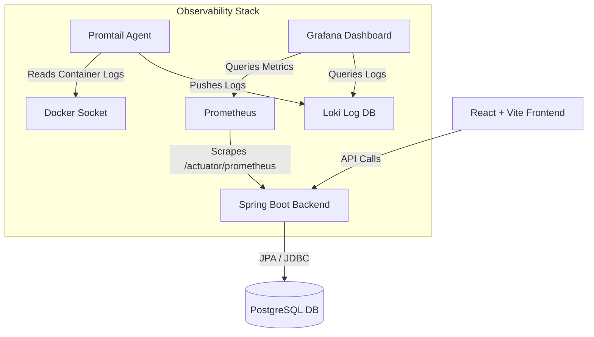

# Infrastruttura di Containerizzazione & Architettura di Monitoraggio (Stack PLG)

Questo documento illustra l'architettura di containerizzazione e la suite di **Osservabilità (Observability)** integrate nel progetto **PhytoSend**.

L'obiettivo dell'infrastruttura è garantire la portabilità dell'intero sistema, semplificare l'ambiente di sviluppo locale tramite meccanismi di *hot-reloading* e introdurre un sistema di monitoraggio centralizzato di livello industriale per metriche e log.

---

## 1. Architettura del Sistema

L'infrastruttura è interamente orchestrata tramite **Docker Compose** ed è suddivisa in due macro-aree: i **Servizi Core** (necessari all'esecuzione dell'applicazione) e i **Servizi di Observability** (dedicati alla telemetria e al tracciamento).



### 1.1. Servizi Core (Applicativi)

* **`phytosend-db` (PostgreSQL 17.6)**:
  DBMS relazionale deputato alla persistenza dei dati. Configurato con volumi Docker permanenti (`db_data`) per garantire l'integrità dei dati utente anche a seguito dell'arresto dei container.
* **`phytosend-backend` (Spring Boot 3.5.8 & JDK 25)**:
  Server applicativo che espone le API RESTful. Include le dipendenze di **Spring Boot Actuator** e **Micrometer Prometheus**, esponendo un endpoint protetto per la telemetria (`/actuator/prometheus`).
* **`phytosend-frontend` (React + Vite)**:
  Interfaccia utente web della SPA (Single Page Application), compilata e servita tramite un server web ottimizzato.

### 1.2. Servizi di Observability (Stack PLG)

* **`phytosend-prometheus`**:
  Time-series database preposto al recupero (tramite *scraping* ad intervalli di 5 secondi) e all'archiviazione delle metriche numeriche prestazionali del server Spring Boot.
* **`phytosend-loki`**:
  Database log-centrico altamente ottimizzato. A differenza di Elasticsearch, indicizza esclusivamente i metadati dei log, riducendo drasticamente l'impatto sulle risorse di sistema.
* **`phytosend-promtail`**:
  Agente locale di log-shipping. È montato direttamente sul socket di Docker (`/var/run/docker.sock`), catturando lo standard output (`stdout`/`stderr`) dei container applicativi e inoltrandolo a Loki.
* **`phytosend-grafana`**:
  Piattaforma analitica e di visualizzazione. Interroga Loki e Prometheus per aggregare i dati telemetrici all'interno di cruscotti (dashboard) analitici in tempo reale.

---

## 2. Porte e Rete di Collegamento

Tutti i servizi comunicano all'interno di una rete virtuale isolata basata su driver bridge (`phytosend-network`). Le porte esposte sull'host locale sono configurate come segue:

| Container / Servizio     | Porta Esterna | Endpoint / Protocollo | Scopo                                                        |
| :----------------------- | :------------ | :-------------------- | :----------------------------------------------------------- |
| `phytosend-frontend`   | `5173`      | HTTP                  | Accesso all'applicazione client                              |
| `phytosend-backend`    | `8080`      | HTTP                  | Interazione con le API REST e documentazione OpenAPI/Swagger |
| `phytosend-db`         | `5432`      | TCP                   | Connessione al DBMS PostgreSQL                               |
| `phytosend-grafana`    | `3000`      | HTTP                  | Portale di monitoraggio e visualizzazione dei dati           |
| `phytosend-prometheus` | `9090`      | HTTP                  | Console nativa per query diagnostiche in PromQL              |
| `phytosend-loki`       | `3100`      | HTTP                  | API REST di Loki (controllo stato su `/ready`)             |

---

## 3. Gestione degli Ambienti di Esecuzione

L'infrastruttura fornisce due distinti file di orchestrazione per coprire le diverse fasi del ciclo di vita del software.

### 3.1. Ambiente di Produzione e Testing (`docker-compose.yml`)

Utilizza i `DockerFile` per compilare i sorgenti in modalità multi-stage (garantendo immagini di produzione minimali basate su Alpine Linux). Ideale per test di integrazione finali.

* **Comando di avvio**:
  ```bash
  docker compose up --build -d
  ```
* **Comando di arresto**:
  ```bash
  docker compose down
  ```

### 3.2. Ambiente di Sviluppo con Hot Reloading (`docker-compose.dev.yml`)

Ottimizzato per la fase di scrittura del codice, permette di riflettere istantaneamente le modifiche apportate nell'IDE all'interno dei container senza dover ricostruire le immagini.

* **Meccanismo di funzionamento**:

  * **Volumi Bind-Mount**: I sorgenti locali del backend (`..`) e del frontend (`../../frontend`) sono mappati direttamente dentro i rispettivi container.
  * **Spring Boot DevTools**: Abilitato tramite variabile d'ambiente `SPRING_DEVTOOLS_RESTART_ENABLED=true`. Ad ogni compilazione o salvataggio di una classe Java, il server effettua un *hot restart* automatico.
  * **Vite Dev Server**: Esegue in modalità live con Hot Module Replacement (HMR) attivo per modifiche istantanee del frontend.
  * **Maven Volume Caching**: Le dipendenze scaricate vengono persistite nel volume `maven_cache`, azzerando i tempi di build successivi.
* **Comando di avvio**:

  ```bash
  docker compose -f docker-compose.dev.yml up
  ```
* **Comando di arresto**:

  ```bash
  docker compose -f docker-compose.dev.yml down
  ```

---

## 4. Flusso di Monitoraggio & Configurazione Telemetrica

### 4.1. Configurazione di Grafana

Per accedere alla console di visualizzazione e importare le dashboard di sistema:

1. Accedere a [http://localhost:3000](http://localhost:3000) utilizzando le seguenti credenziali preconfigurate:
   * **Username**: `admin`
   * **Password**: `admin`
2. **Aggiunta del Data Source Prometheus**:
   * Navigare su *Connections* ➔ *Data Sources* ➔ *Add data source* ➔ Selezionare **Prometheus**.
   * Impostare l'URL di connessione interna: `http://prometheus:9090`.
   * Cliccare su **Save & test**.
3. **Aggiunta del Data Source Loki**:
   * Tornare su *Data Sources* ➔ *Add data source* ➔ Selezionare **Loki**.
   * Impostare l'URL di connessione interna: `http://loki:3100`.
   * Cliccare su **Save & test**.

### 4.2. Importazione Dashboard JVM e Richieste HTTP

È stata predisposta l'integrazione con la dashboard Spring Boot standard (ID Grafana: **`12900`**).

* Cliccare su **`+`** (in alto a destra) ➔ **Import dashboard**.
* Inserire l'ID `12900` e cliccare su **Load**.
* Associare la sorgente Prometheus precedentemente creata e completare l'importazione.
* Il pannello mostrerà metriche dettagliate su:
  * Percentuale di CPU del processo e del sistema.
  * Allocazione e Garbage Collection della memoria JVM (Heap e Non-Heap).
  * Statistiche e tempi medi delle chiamate HTTP per singola URI.
  * Connessioni attive del pool di database HikariCP.

### 4.3. Analisi dei Log Centralizzata

Tramite la sezione **Explore** di Grafana è possibile analizzare i flussi di log del sistema integrando i metadati di Docker:

* Selezionare come sorgente dati **Loki**.
* Filtrare i log tramite query LogQL (es. `{container="phytosend-backend"}`).
* Attivando il flag **Live**, è possibile ispezionare l'output del server in tempo reale, semplificando le attività di debugging e tracciamento delle eccezioni.
